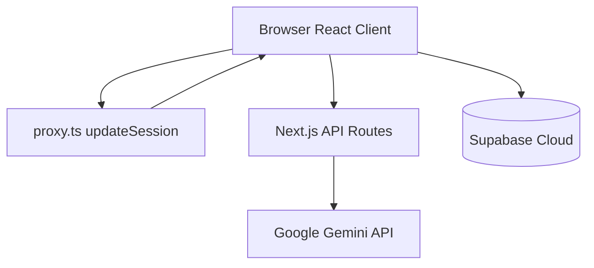

# 05 — Architecture and Patterns

## Request flow

## Authentication

1. **Email/password** — `app/login/LoginForm.tsx` → `supabase.auth.signInWithPassword`
2. **Google OAuth** — `GET /api/auth/google` → Supabase OAuth → `/auth/callback`
3. **Session refresh** — `utils/supabase/middleware.ts` `getClaims()` in `proxy.ts`
4. **Protected routes** — `/switchboard`, `/vault`, `/portfolio`, `/profile` redirect to `/login?next=...`

Auth URL config lives in `supabase/config.toml`; push with `npm run auth:config:push`.

## Supabase clients

| File | Use |
|------|-----|
| `utils/supabase/client.ts` | Client components |
| `utils/supabase/server.ts` | Server components, route handlers |
| `lib/supabase/admin.ts` | Service role (server only, rare) |

## React context providers

| Context | File | Purpose |
|---------|------|---------|
| Active vault | `lib/context/active-vault.tsx` | Unlocked vault, handshake phase |
| Focus | `lib/context/focus.tsx` | Keyboard nav, focused pulse id |
| Overlay stack | `lib/context/overlay-stack.tsx` | Inspector / drawer stacking |

## Vault unlock flow

1. User enters encryption key in `EncryptionKeyModal`
2. Key validated client-side against `vaults.encryption_test` ciphertext
3. Key stored in `sessionStorage` as `codexone_key_{vaultId}`
4. All decrypt/encrypt for that vault uses this key until tab close or sign-out
5. Sign-out clears keys via `clearVaultSessionKeys()` + `clearDerivedKeyCache()`

## Site URL resolution

`lib/site-url.ts` `getSiteUrl()` — production must **not** use `localhost:14000` in Vercel env. Prefers request origin, then `NEXT_PUBLIC_SITE_URL`, then `VERCEL_URL`.

## Performance patterns (large vaults)

- **Lazy decrypt** — `record-fetch.ts` loads title first; body on inspector open
- **Progressive batches** — `fetchVaultTemporalObjectsProgressive`, batch size 50
- **PBKDF2 cache** — `encryption-core.ts` derived key cache per password+salt
- **Virtualized ledger** — `RecordLedger.tsx` windowing

## Adding a new feature checklist

1. Does it touch sensitive text? → E2E encrypt in `lib/encryption-core.ts`
2. New DB column? → Migration + `db:types` + update fetch/seal paths
3. New route? → Under `app/(dashboard)/` if authenticated
4. New API? → `app/api/` only for secrets (Gemini key) or OAuth
