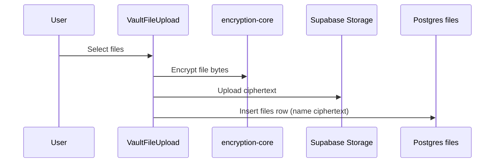
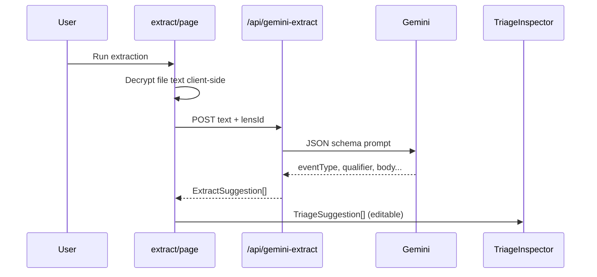
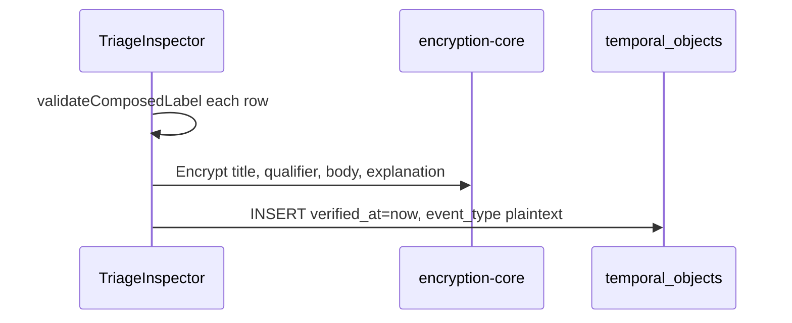
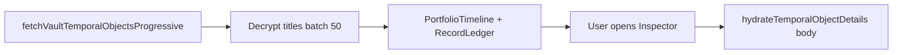

# 14 — Data Flows

## 1. Ingestion

- Route: `/vault/[id]/ingest`
- Formats: `lib/files/supported-formats.ts`

## 2. Extraction

- Model: `gemini-2.5-flash`
- Output: `eventType` + `qualifier` (not document title)

## 3. Seal (batch)

- `lib/temporal/seal-batch.ts`

## 4. Seal (single pulse)

- Record Home → Inspector → `sealPulse()` → UPDATE row with `verified_at`

## 5. Record Home load

- Large vaults: first paint after ~50 rows

## 6. Query (filter)

- **Not LLM** — `filterSealedPulses(objects, query)` in memory
- Empty query → all objects
- Active query → **sealed only**, token match on eventType, qualifier, date, label

## 7. Portfolio / Results Mode

- `fetchPortfolioDateObjects` → `ResultsModeDrawer` → `PortfolioTimeline`
- Cross-vault; RLS limits to member vaults

## Pulse object shape (client)

`PortfolioTemporalObject` in `lib/temporal/portfolio-fetch.ts`:

- `eventType`, `qualifier`, `composedLabel`
- `parsedDate`, `category`, `isSealed`, `isLocked`
- `body`, `explanation` (lazy)
